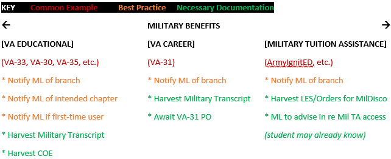
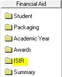

# 🔍 Analyzing CampusNexus


If an AA tells you an applicant is VFPA-ready, trust **but verify**!



When first analyzing CampusNexus for VFPA readiness, always look for:

1. ADMGenCom featuring Q1Q2Q3
2. The sum of Q1Q2Q3 ≤ program length
3. Q1 aligns with the most recent ADMCheckList or ADMAdjustForm
4. Future status
5.  Financing type — FA, Military, CoPay, and/or CASH

    A. If FA, which [will apply to 90% of applicants](https://nces.ed.gov/fastfacts/display.asp?id=31), will need FA documents: KRD approval (if KY address); clean 23-24 ISIR

    B. If non-FA, will need various documents (details vary per type and are below)

If all of the above are OK, the EC may confirm BYOD yes/no and schedule VFPA.

If all of the above are NOT OK, the EC will track the applicant for progress until OK.

The remainder of this section will explain how to analyze CampusNexus records.


* [ ] Review CN for VFPA setup prerequisites
  * [ ] Does CampusNexus Activities feature an ADMGenCom featuring Q1Q2Q3?
    * [ ] In CampusNexus, navigate to Contact Manager > Activities
    * [ ] Sort by "Date Completed" column
    * [ ] Scroll down to the bottom of the menu
    * [ ] Look for "ADM - General Comment" (ADMGenCom) activity
      *   [ ] ADMGenCom may be closed (preferred) or pending

          * [ ] Example:

          
      * [ ] ADMGenCom must feature Q1Q2Q3 plus any other content AA deems useful
        * [ ] Example: 12/12/12 = 12 hours for Quarter 1, Quarter 2, & Quarter 3
      * [ ] If no ADMGenCom, ask AA to add ADMGenCom and notify EC when done
  * [ ] Is the sum of Q1Q2Q3 less than or equal to maximum program length?
    * [ ] Calculate the sum of Q1Q2Q3 (for example, 12/12/12 = 36)
    *   [ ] Go [here](https://sullivanedu.sharepoint.com.mcas.ms/sus/admissions/Training2/Forms/AllItems.aspx?id=%2Fsus%2Fadmissions%2FTraining2%2F2022%20Product%20Knowledge%20Binder%20with%20Tuition%20Changes\&viewid=8cd30b7e%2Dacb6%2D4a72%2D872a%2D553b237973e4) to identify the total credit hours possible for applicant's chosen program

        * [ ] Example:&#x20;

         (1).png>)
    * [ ] If the sum of Q1Q2Q3 is less than or equal to the total credit hours for the applicant's program of choice, accept Q1Q2Q3 as valid. Otherwise, reject Q1Q2Q3 as invalid and ask AA directly to update the ADMGenCom with a Q1Q2Q3 that is equal to or less than the total credit hours for the applicant's program of choice.
      * [ ] Example: if given Q1Q2Q3 sums to 32 but program total is 24, Q1Q2Q3 may need to shift to 12/12/0 or program change may be needed (TBD by AA).&#x20;
  * [ ] Does Q1Q2Q3 align with Admissions' most recent "Check List" or "Adjustment Form"?
    * [ ] Navigate to CampusNexus Documents .png>)
    * [ ] Ensure that you are reviewing all enrollments under Admissions' module: .png>)
    * [ ] Click .png>) to alphabetize all documents
    *   [ ] Review visually the  (2) (1).png>)column for the most recently approved form

        * [ ] Example

        .png>)
    * [ ] Click the row belonging to the most recently approved form
    * [ ] Click .png>)
    * [ ] Click  (2).png>)
    *   [ ] Review visually for "Tution Type" & "Enrollment Time"

        * [ ] Example

        .png>)

        * [ ] If PT/credit & Q1 ≤ 8, OK
        * [ ] If FT/fixed & Q1 ≥ 12, OK
        * [ ] If anything else, advise AA to seek OK Adjustment Form _or_ seek Nina Martinez's approval
  * [ ] Is applicant in Future status for an upcoming academic start date?
    *   [ ] In CampusNexus, navigate to Admissions > Status History

        * [ ] Example:

        
    * [ ] If Future, proceed.  Otherwise, monitor for Future status.
  * [ ] Confirm the financing type
    * [ ] Navigate to CampusNexus Documents  (1) (1).png>)
    * [ ] Select the "Document" header to alphabetically sort all documents
    *   [ ] Search for and highlight "ADM - Application for Enrollment"

        * [ ] If multiples, favor the application with the most recent "Requested" date
          * [ ] If multiples, favor the application with "use for acceptance" in comments
        * [ ] Select "Display Document"
        * [ ] Select the "View Document" icon  (1) (1).png>)
        * [ ] Look for an open one of these 2 documents:

         (1) (1).png>)

        * [ ] Search (CTRL-F) for "plan to pay"

         (2).png>)

        * [ ] If "Financial Aid"...
          * [ ] KRD must be approved, denied, or no longer needed _unless_ ADOA declares KRD N/A for VFPA setup purposes
            * [ ] Navigate to CampusNexus Documents  (1) (1).png>)
            * [ ] Select the "Admissions" Module: .png>)
            * [ ] Select the "Document" header to alphabetically sort all documents
            * [ ] Search for "ADM - Kentucky Residency Determination"
              * [ ] Ignore any review not conducted 12 months prior to the intended academic start date.
              * [ ] Focus only on the review featuring the most recent date.
              * [ ] If document is in a "requested" status, monitor document for any other status (as "requested" means KRD documents need to be submitted by applicant and reviewed by KRD Reviewer)
              * [ ] If document is in an "insufficient" status, monitor for any of these final outcomes: approved; denied; no longer needed.
                * [ ] "Approved" means applicant is eligible for _potential_ CAP/KTG grants.
                * [ ] "Denied" means applicant was disqualified from receiving CAP/KTG (reasons vary but defer to KRD Reviewer).
                * [ ] "No Longer Needed" means applicant was disqualified from receiving CAP/KTG (reasons vary but defer to KRD reviewer).
          *   [ ] 2021-22 FAFSA required for any applicant starting 7/1/2021-6/30/2022

              * [ ] Navigate to Financial Aid > ISIR

              

              * [ ] Ensure Award Year is relevant:  (2).png>)
              * [ ] If ISIR displays and there is no C Code or Reject Code, regard ISIR as clean (error-free). Example:

               (2).png>)

              * [ ] If ISIR displays and there is a C Code but no Reject Code, check Groups for Student to see if FP logged a "date off" so that C Code may safely be disregarded. Example:

              .png>)

              * [ ] If ISIR displays and there is a C Code and/or Reject Code but no "date off" within Groups for Student, plan to schedule a Virtual Financial Planning Preparatory Appointment (VFPPA) for the applicant.
          * [ ] 2022-23 FAFSA required for any applicant starting 7/1/2022-6/30/2023
            * [ ] For guidance, see section directly above but change Award Year to 2022-23.
          * [ ] As of 10/1/2022, 2023-24 FAFSA required for any applicant starting 7/1/2023-6/30/2024
            * [ ] Most likely, CampusNexus will not be upgraded to show 2023-24 FAFSA until around 4/1/2023, so EC will need to secure 2023-24 FAFSA Confirmation Page Email featuring a Confirmation Number, Data Release Number, & EFC Score, then upload the email to CND
        * [ ] If "Self-Financing"...applicant will make cash payments on a monthly or quarterly basis (TBD by FPC during eventual VFPA)
        *   [ ] If "VA Benefits" or "Military Tuition Assistance"...

            * [ ] See:

            .png>)

            * [ ] For additional needs, campus ML to advise.
              * [ ] Louisville: Sam Allen; sallen@sullivan.edu
              * [ ] DuPont: Leah Schultz; lschultz@sullivan.edu
              * [ ] Lexington: Savannah Slusher; sslusher@sullivan.edu
              * [ ] SCO (All Campuses): Meshell LaBaun; mlabaun@sullivan.edu
        * [ ] If "Company-Paid Benefits"...
          * [ ] Navigate to CampusNexus Documents  (1) (1).png>)
          * [ ] Select the "Financial Aid" Module:  (1).png>)
          * [ ] Select the "Document" header to alphabetically sort all documents
          * [ ] Search for "FP - Company Pay Policy"
            * [ ] If document has been logged, highlight document, look for  (1).png>) icon to the left of highlighted document, select  (1).png>) button, select .png>) button, and proofread upload.
            * [ ] If no CoPayPol, ask AA to harvest CoPayPol and forward to EC when done
        * [ ] If "Yes" to "Are you currently service in the military (active duty or National Guard/Reserve)"...
          * [ ] Navigate to CampusNexus Documents  (1) (1).png>)
          * [ ] Select the "Document" header to alphabetically sort all documents
          * [ ] Search for and highlight "ADM - Military Orders"
            * [ ] Status of "Approved" means applicant will receive a military discount
            * [ ] Status of "On File" means applicant _may_ receive a military discount _pending approval_
            * [ ] If applicant desires discount consideration, applicant may provide:
              * [ ] Leave & Earnings Statement (LES)
              * [ ] Active Duty Military Orders
              * [ ] Uniformed presence physically on-campus to AA, ML, or SCO
        * [ ] Once done with your analysis, log in Velocify your ANALYSIS & NEXT STEPS
          * [ ] Example:
            * [ ] ANALYSIS: ADMGenCom w/ Q1Q2Q3 (6/27); 12/12/0 Q1Q2Q3; sum Q1Q2Q3 = prog length of 24, so OK; Q1 aligns w/ ADMCheck 6/25's FT/fixed, so OK; Fut for BusAdmCert; KRD approved; clean 21-22 (IND); clean 22-23; ... NEXT: need BYOD yes/no; need conf FA/CASH (per 6/27 app); need sched VFPA
