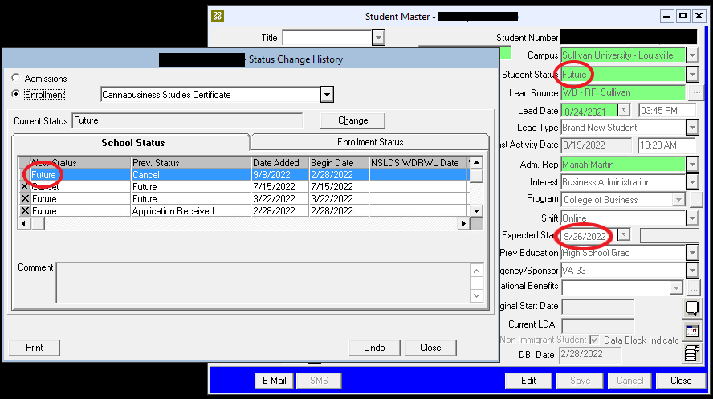

# 🤓 Analyzing CampusNexus

* [ ] Check CampusNexus for VFPA Setup Prerequisites
  * [ ] Does CampusNexus Activities feature an ADMGenCom?
    * [ ] In CampusNexus, navigate to Contact Manager > Activities
    * [ ] Sort by "Date Completed" column
    * [ ] Scroll down to the bottom
    * [ ] Look for "ADM - General Comment" (ADMGenCom) activity
      *   [ ] ADMGenCom may be Closed & Completed (preferred) or Pending

          * [ ] Example:

          
      * [ ] ADMGenCom may feature any content; activity just has to feature _some_ content.
      * [ ] If no ADMGenCom, ask AA to add ADMGenCom and notify EC when done.
  * [ ] Does EC know Q1Q2Q3?
    * [ ] Q1Q2Q3 may be featured within ADMGenCom; alternatively, AA may tell EC directly.
    * [ ] Example: 12/12/12 = 12 hours for Quarter 1, Quarter 2, & Quarter 3
  * [ ] Is Q1Q2Q3 less than or equal to program length?
    * [ ] Sum Q1Q2Q3 (for example, 12/12/12 = 36)
    *   [ ] Go [here](https://sullivanedu.sharepoint.com.mcas.ms/sus/admissions/Training2/Forms/AllItems.aspx?id=%2Fsus%2Fadmissions%2FTraining2%2F2022%20Product%20Knowledge%20Binder%20with%20Tuition%20Changes\&viewid=8cd30b7e%2Dacb6%2D4a72%2D872a%2D553b237973e4) to identify the total credit hours for the student's program of choice

        * [ ] Example:&#x20;

        .png>)
    * [ ] If sum Q1Q2Q3 is less than or equal to total credit hours for the student's program of choice, accept Q1Q2Q3 as valid.  Otherwise, reject Q1Q2Q3 and ask AA directly to provide a Q1Q2Q3 that is equal to or less than the total credit hours for the student's program of choice.
  * [ ] Is applicant in Future status for a particular academic start date?
    *   [ ] In CampusNexus, navigate to Admissions > Status History

        * [ ] Example:

        .png>)
    * [ ] If Future, proceed.  Otherwise, monitor for Future status.
  * [ ] Identify the financing type
    * [ ] Navigate to CampusNexus Documents .png>)
    * [ ] Select the "Document" header to alphabetically sort all documents
    *   [ ] Search for and highlight "ADM - Application for Enrollment"

        * [ ] If multiples, favor the application with the most recent "Requested" date
          * [ ] If multiples, favor the application with "use for acceptance" in comments
        * [ ] Select "Display Document"
        * [ ] Select the "View Document" icon .png>)
        * [ ] Look for an open one of these 2 documents:

        .png>)

        * [ ] Review and note this section:

        
    * [ ] If FA...
      * [ ] Do we have one FAFSA or, if necessary, both FAFSAs?
      * [ ] Is KRD approved?
    * [ ] If CoPay, do we have a CoPayPol in CND?
    * [ ] If Military...
      *
