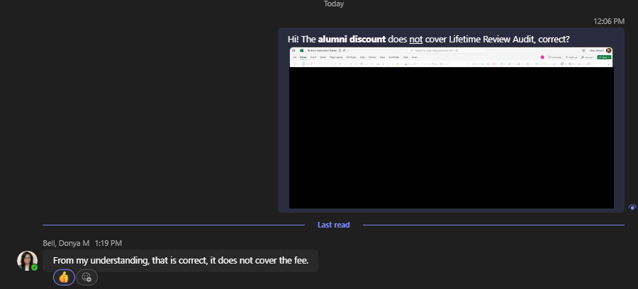

# 🎓 Processing Alumni Discounts


Under construction!



Used for training purposes as recently as 8/8/2025.\
Authored by Amy Smith, Senior Director of Enrollment Management Compliance / Ombudsman.


<figure><figcaption>
Standing Directive A: treat "pending graduate" status as synonymous with "graduate" status. Source: SADOA Janet Zahnd to EC Sam Allen via Microsoft Teams on 8/28/2025.
</figcaption></figure>

<figure><figcaption>
Standing Directive B: do not approve alumni discount if "Lifetime Review Audit" is the target program. Source: Registrar Donya Bell to EC Sam Allen via Microsoft Teams on 9/15/2025.
</figcaption></figure>
