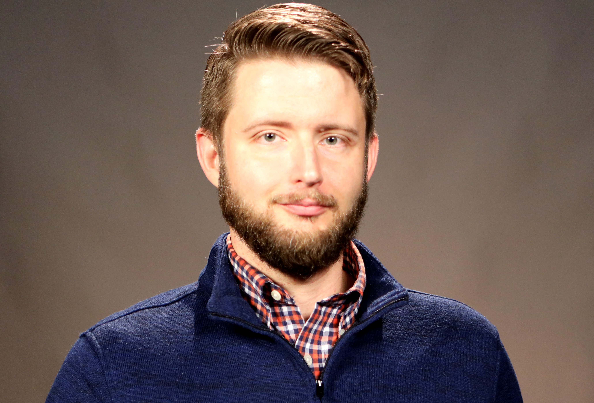

# 🟢 Samuel J. Allen

Enrollment Coordinator & Military Liaison :flag\_us: — Campus: 3101 Bardstown Rd (Louisville, KY)

Communication Preferences: :purple\_circle: Teams | :e-mail: sallen@sullivan.edu | :telephone: (502) 413-8565

## Professional Bio


Sam was hired December 2010. Sam's work style can best be described as applying due diligence, then executing next steps — in that order (because Sam believes that the ECs truly should be called Chaos Controllers, therefore Sam sees but 2 ways to perform any task: correctly; and again). Sam also strongly believes in solving problems with a "tech first" approach, so Sam is quick to log activity notes within shared databases or provide FAFSA help remotely by default. Sam created the original Kentucky Residency Determination (KRD) process, the original EC SOP, and this reimagined EC SOP. Sam also became a Military Liaison circa April 2019, 4 months after concluding 21 months of service as SU's Project Manager, merging multiple campuses into one. For more information about Sam's work history, including awards earned while with SU, see [LinkedIn](https://www.linkedin.com/in/samueljustinallen/).


## Personal Bio


Home(s): [Louisville, KY](https://en.wikipedia.org/wiki/Louisville,_Kentucky)

Church: [Southeast Christian Church](https://www.southeastchristian.org/) ([Blankenbaker](https://my.southeastchristian.org/location/blankenbaker) & [SE Online](https://online.southeastchristian.org/))

Partner: Vanessa ([wife](https://www.linkedin.com/in/vanessawyn/))

Interest(s): Bitcoin :coin:; homesteading 🏕️ ; hiking 🥾; birding 🐦; serving as a KY Colonel 🎖️                              &#x20;

Favorite Snack(s): Starbucks' flat white with coconut milk, blonde espresso, and cinnamon :coffee:

Favorite Podcast(s): [Ask Pastor John](https://podcasts.apple.com/us/podcast/ask-pastor-john/id618132843); [Darknet Diaries](https://podcasts.apple.com/us/podcast/darknet-diaries/id1296350485)

Alma Mater(s): 🔴⚫ [University of Louisville](https://louisville.edu/) '07 '08

&#x20;                            🔵⚪ [Paintsville High School](https://sites.google.com/paintsville.kyschools.us/paintsville/home) '03

Hometown: [Paintsville, KY](https://en.wikipedia.org/wiki/Paintsville,_Kentucky)


<figure><figcaption>
Sam proposed to his wife, Vanessa, at Spindletop Hall in Lexington, KY on May 26, 2024. They married 145 days later.
</figcaption></figure>
